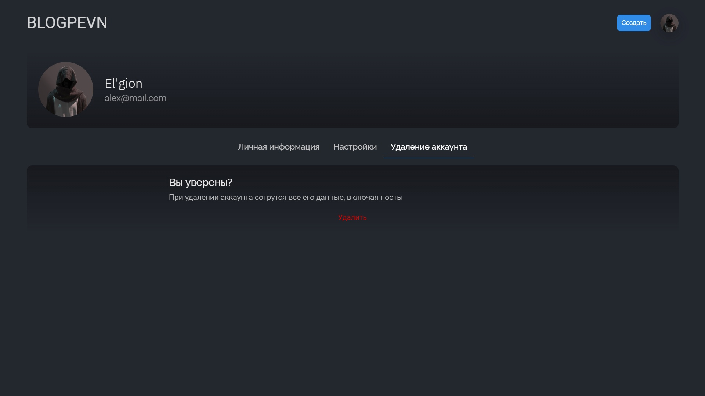

# blog-pevn

## Description
This project was created as a social network where users can post and respond to posts. PEVN stack is used here

## Options

### Authorization


### Home page


### User info


### User settings


### Deleting a user


### Create a post


### Change post


## Build Setup

```bash
# install dependencies
$ npm install

# serve with hot reload at localhost:3000
$ npm run dev

# build for production and launch server
$ npm run build
$ npm run start

# generate static project
$ npm run generate
```